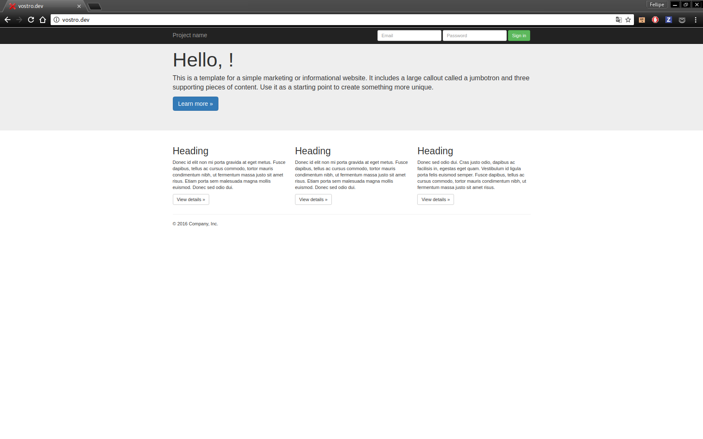

# Site example using Thanks For All The Fish Micro Web Framework

Site example using [Thanks For all The Fish Micro web Framework](https://github.com/delete/thanksforallthefish).




# Installing/Updating the framework

If there is a instalation, the script will just update the framework.

`./manager.sh -u `

# Runing using Docker

`./manager.sh -r `

## Directories

```sh
.
├── configs
│   ├── autoload.php
│   ├── debug.php
│   ├── define.php
│   ├── env.json
│   └── start.php
├── Dockerfile
├── manager.sh
├── modules
│   └── website
│       ├── SiteController.php
│       └── templates
│           └── index.html
├── public
│   ├── index.php
│   └── website
│       ├── css
│       ├── fonts
│       ├── img
│       └── js
├── settings.php
├── tests
│   └── modules
│       ├── FakeView.php
│       └── website
│           └── SiteControlerTest.php
├── tfatf
└── vendors
```